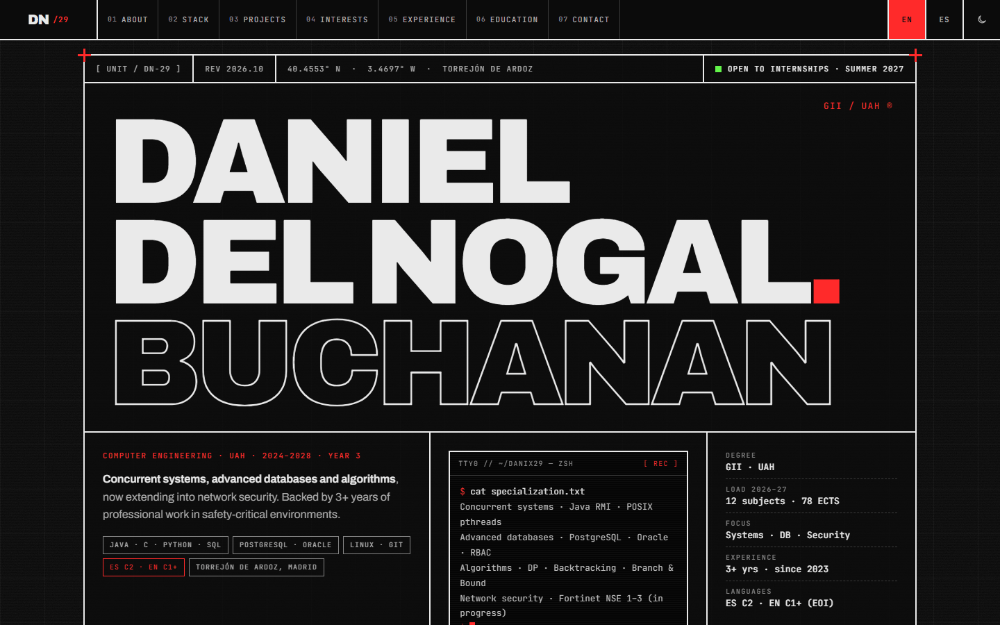
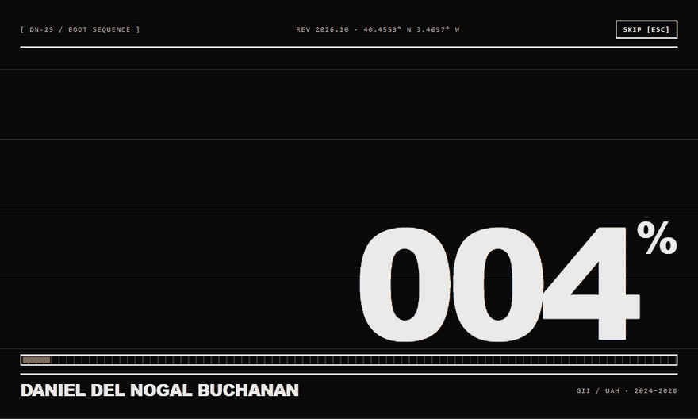
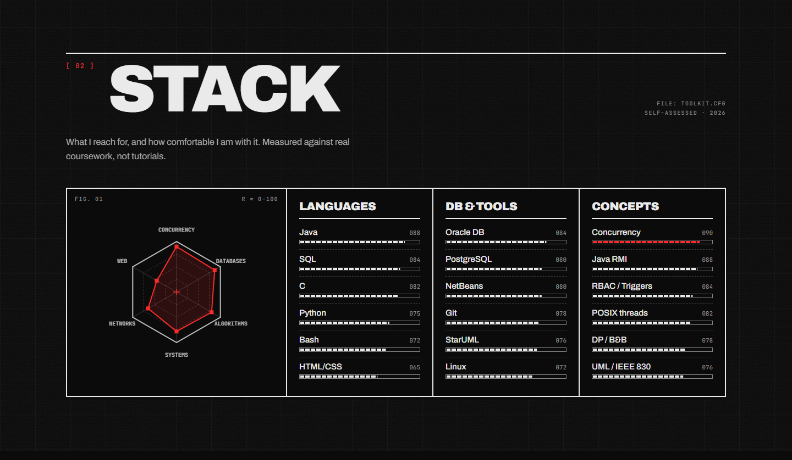
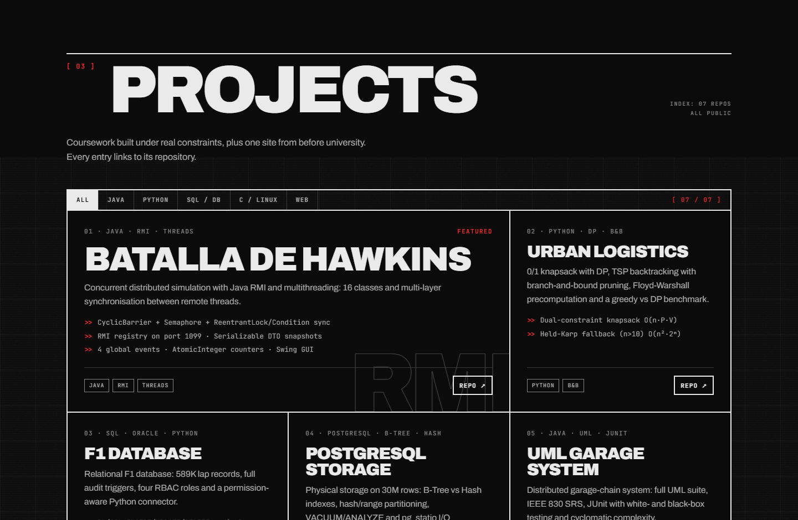
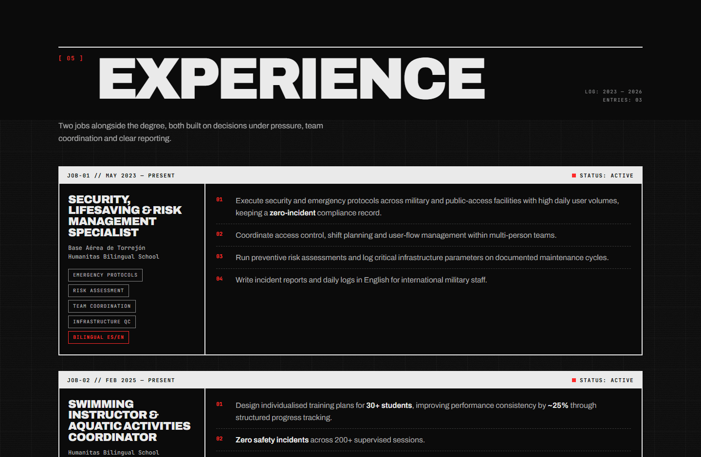
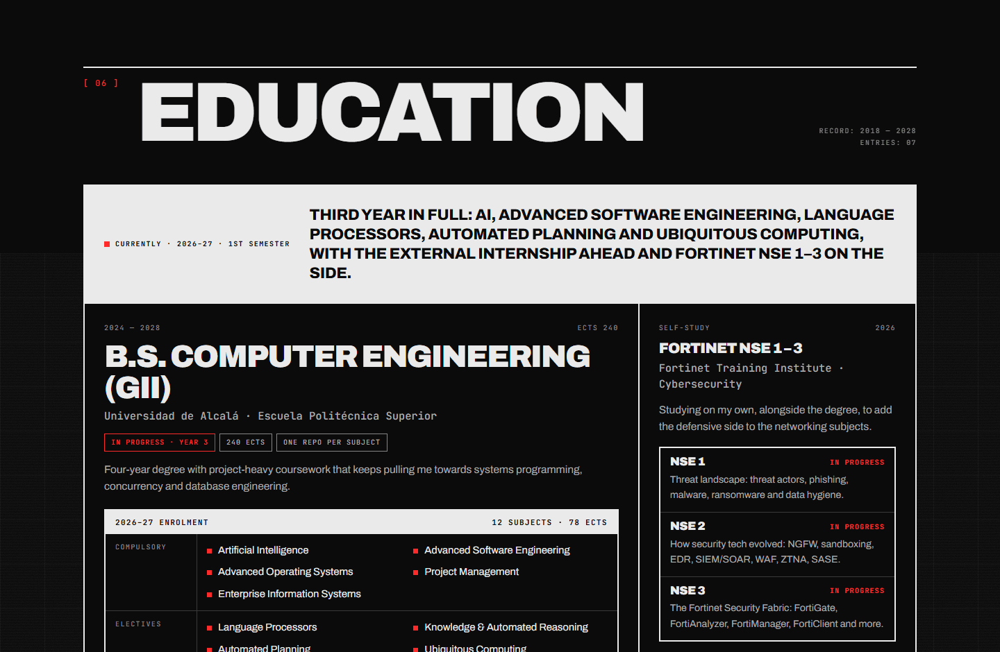
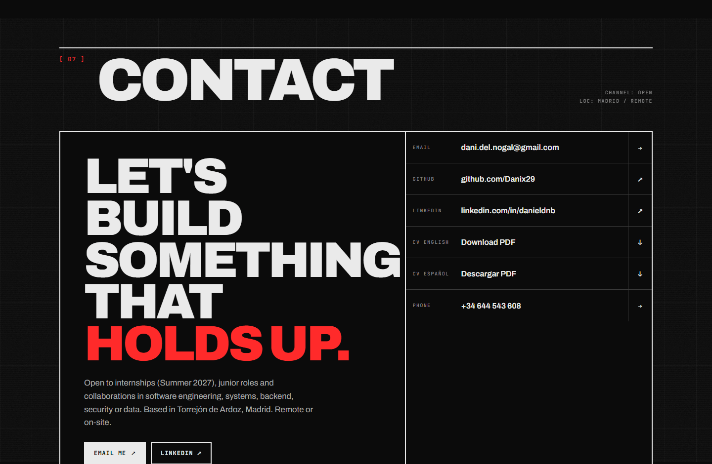
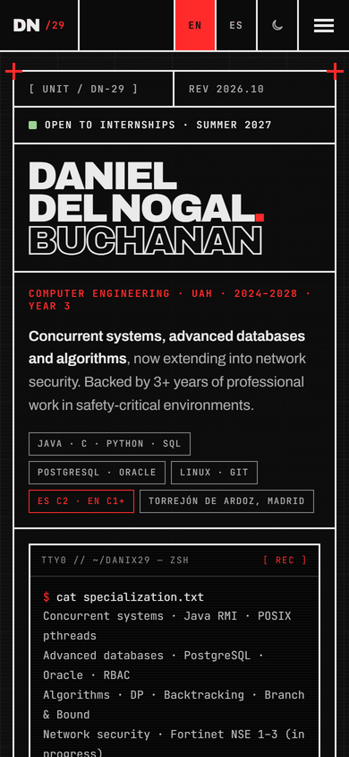
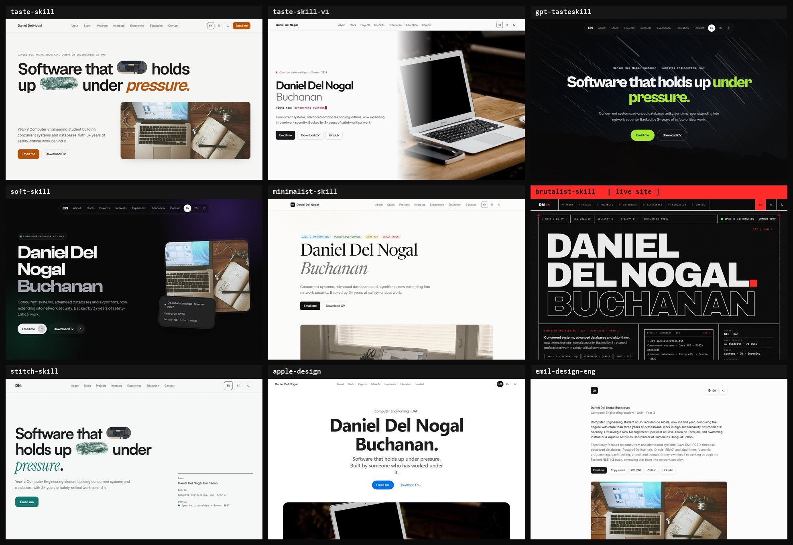

<div align="center">

[](https://danix29.github.io)
[](https://danix29.github.io/skins/)
[](https://github.com/Danix29/Danix29.github.io/actions/workflows/pages/pages-build-deployment)


<a href="https://danix29.github.io">
  <picture>
    <source media="(prefers-color-scheme: dark)" srcset="assets/hero-dark.png"/>
    <source media="(prefers-color-scheme: light)" srcset="assets/hero-light.png"/>
    
  </picture>
</a>

<sub>The screenshot follows your GitHub theme: dark substrate in dark mode, Swiss-print paper in light mode. The site has the same toggle.</sub>

</div>

---

## ⏻ Boot sequence

<div align="center">



</div>

Every visit opens with a ~2.5 s boot: a terminal log, a stepped counter from `000` to `100 %`, a segmented load bar and six slats that retract to reveal the hero. Skip it with a click, <kbd>Esc</kbd>, <kbd>Enter</kbd> or <kbd>Space</kbd>. It never plays under `prefers-reduced-motion`, and a CSS failsafe hides it after 8 s if JavaScript dies.

---

## ▦ Design system

<table>
<tr>
<td width="50%" valign="top">

**Palette** · one accent, no gradients

| | Token | Role |
|---|---|---|
|  | `#0B0B0B` | Carbon substrate |
|  | `#EAEAEA` | Phosphor ink |
|  | `#FF2A2A` | Aviation red, the only accent |
|  | `#4AF626` | Terminal green, exactly one status light |
|  | `#EAE8E3` | Light theme: unbleached paper |

</td>
<td width="50%" valign="top">

**Type** · two families, extreme contrast


**Rules**

- `border-radius: 0` everywhere
- 2 px compartments drawn with the `gap` + ink-parent trick
- Motion runs on `steps()`, like machinery
- Blueprint grid, CRT scanlines and SVG grain on fixed layers
- Display type sized from its **container** (`cqi`), so it never overflows, even with a larger browser font

</td>
</tr>
</table>

---

## ▤ Sections

<table>
<tr>
<td width="50%"><br><sub><b>02 · Stack</b> · canvas radar + segmented meters that fill on first view</sub></td>
<td width="50%"><br><sub><b>03 · Projects</b> · gapless grid, filters, cards invert on hover</sub></td>
</tr>
<tr>
<td width="50%"><br><sub><b>05 · Experience</b> · log entries <code>JOB-01 // STATUS: ACTIVE</code></sub></td>
<td width="50%"><br><sub><b>06 · Education</b> · 2026–27 enrolment, Fortinet NSE 1–3, history</sub></td>
</tr>
<tr>
<td width="50%"><br><sub><b>07 · Contact</b> · oversized CTA + link table</sub></td>
<td width="50%" align="center"><br><sub><b>Mobile</b> · single column below 768 px, no horizontal scroll</sub></td>
</tr>
</table>

Also on the page: **01 · About** (bio, stats, language meters), **04 · Interests**, a scroll-scrubbed manifesto and two marquees.

---

## ⌨ Interactions

| | | | |
|:---:|---|:---:|---|
| ⏻ | Boot intro, skippable | ◐ | Dark / Swiss-print light theme, remembered |
| 🌐 | EN / ES switch, remembered | ▦ | Shutter reveals in 6 mechanical steps |
| ▸ | Typed terminal after the boot | ◉ | Radar + meters animate on first view |
| ⧉ | Project filters that keep the grid gapless | ▤ | Word-by-word scroll-scrubbed statement |
| <kbd>?</kbd> | Shortcuts panel | <kbd>g</kbd> + letter | Jump to a section |
| <kbd>t</kbd> | Toggle theme | <kbd>l</kbd> | Toggle language |

<sub>And a Konami code. You know the one.</sub>

---

## ⧉ Nine design skills, one portfolio

<div align="center">

<a href="https://danix29.github.io/skins/"></a>

</div>

The same content rendered nine times, each page following the rules of a different design skill: **taste-skill**, **taste-skill-v1**, **gpt-tasteskill** (real GSAP ScrollTrigger), **soft-skill**, **minimalist-skill**, **brutalist-skill** (this site), **stitch-skill** (+ its [`DESIGN.md`](skins/stitch-skill-DESIGN.md)), **apple-design** (real spring physics) and **emil-design-eng**. They carry no analytics and are `noindex`. → [danix29.github.io/skins](https://danix29.github.io/skins/)

---

<details>
<summary><b>⚙ Under the hood</b></summary>
<br>

| Layer | Choice | Why |
|---|---|---|
| HTML | Single `index.html` | Zero build step, zero dependencies |
| CSS | Inline `<style>`, tokens in `:root` | Self-contained; the light theme only swaps tokens |
| JS | One IIFE in an inline `<script>` | No framework; one rAF-throttled passive scroll listener |
| Fonts | Google Fonts: Archivo + JetBrains Mono | Preconnect, `display=swap` |
| Hosting | GitHub Pages | Deploys on every push to `main` |

```
Danix29.github.io/
├── index.html        ← the whole site
├── favicon.svg       ← black/white "DN" plate with a red band
├── skins/            ← nine design-skill variants + gallery + DESIGN.md
├── assets/           ← screenshots used in this README
└── README.md
```

**Analytics** · [GoatCounter](https://www.goatcounter.com) (no cookies, GDPR-friendly) and [Microsoft Clarity](https://clarity.microsoft.com) (heatmaps, session recordings), both async.

**SEO** · `description`, Open Graph and Twitter Card tags; OG image generated with [capsule-render](https://github.com/kyechan99/capsule-render).

**Local**

```bash
python -m http.server 8080   # then open http://localhost:8080
```

</details>


<div align="center">

[](https://www.linkedin.com/in/danieldnb/)
[](https://github.com/Danix29)
[](https://github.com/Danix29/Resume)

<sub>Daniel Del Nogal Buchanan · Computer Engineering · Universidad de Alcalá</sub>

</div>
